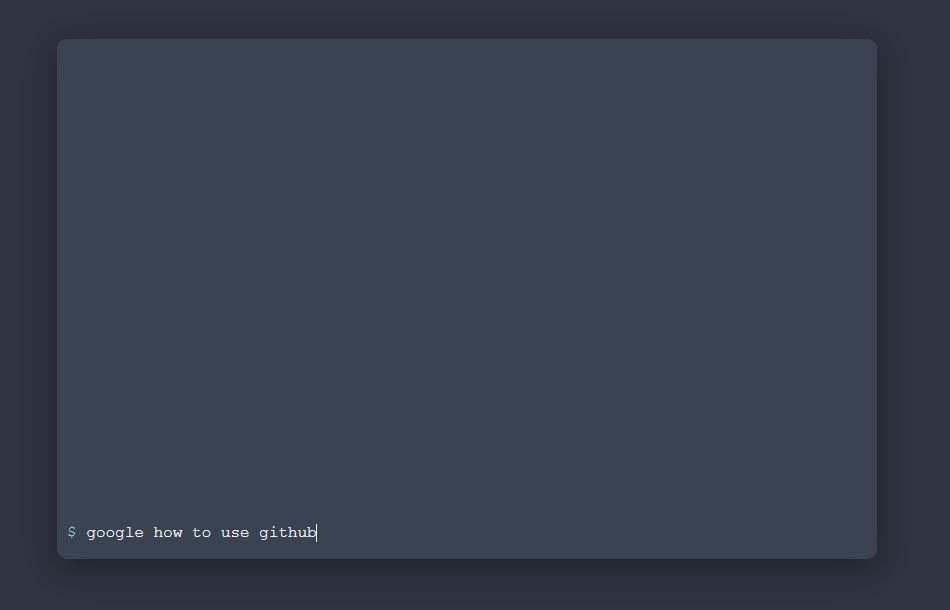

# _terminalSP:_ a unix terminal inspired startpage

_terminalSP_ is a startpage inspired by many of the wonderful posts on [https://reddit.com/r/startpages/](https://reddit.com/r/startpages/) . It functions as a start/home page with the following features:

Live demo available at [https://wars2k.github.io/terminalSP/](https://wars2k.github.io/terminalSP/).

*  Easily search common websites - search google, spotify, reddit, youtube, google maps, or add your own custom searches.
*  Create bookmarks organized in locally-stored directories.
    *   Ability to set “password” protected directories
*    Choose from 7 distinct themes or edit specific styles directly from the terminal.
*   All data stored in localStorage - no database required.

_terminalSP_ is made entirely out of HTML, CSS, and Javascript, and there are no back-end requirements. All data is stored in localStorage, so it’s lightweight and easy to work with.

## List of Commands

### General

`hello` - sends a greeting

`clear` - clears the terminal

`date` - outputs current date

`help` - lists commands

`weather` - outputs current weather at a given location

### Searches

`google` - searches google

`reddit` - searches for a specific subreddit

`youtube` - searches youtube

`googlemaps` - searches google maps

`spotify` - searches spotify

`twitch` - searches twitch

### Appearance

`style` - changes specific styles of the page. Doesn’t last between sessions

`theme` - pick between themes. This lasts between sessions

### Directory System

`cd` - change directory

`ls` - list what’s in the current directory

`pwd` - present working directory

`mkdir` - create a new directory

`rmdir` - remove a directory, but doesn’t delete the bookmarks that were inside of it.

`mkpassword` - set a password for private directories.

`info` - displays the date & time that a directory was created

### Bookmark shortcuts

`make` - makes a new shortcut

`go` - goes to a shortcut that’s been created with `make`

`rm` - removes shortcuts from directories and deletes them from local storage.

`inspect` - displays the link that the shortcut links to and the date & time that the shortcut was created
